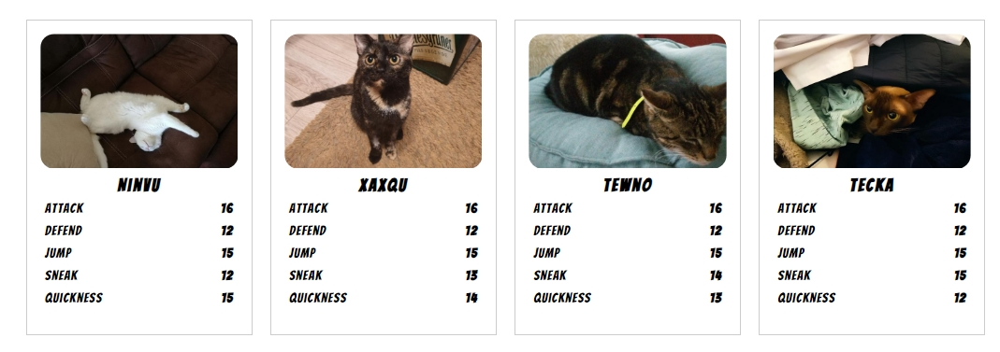

# Cat Battles
## A small card game with cats and turn-based battles.

The cards can be created at https://passi-flora.github.io/tradingcards/.   
An example file can be found at [exampledata.txt](exampledata.txt).   
The images are from CATAS (Cat as a service / https://cataas.com/).  

# Format
The cards are designed in the traditional trading card format (2.5 " x 3.5 "). 
They are meant to be printed by yourself (landscape format, DIN A4) and fit into trading card sleeves. 

Have fun playing!

### Rules
[Rules_de](rules_de.md)  
[Rules_en](rules_en.md) 

