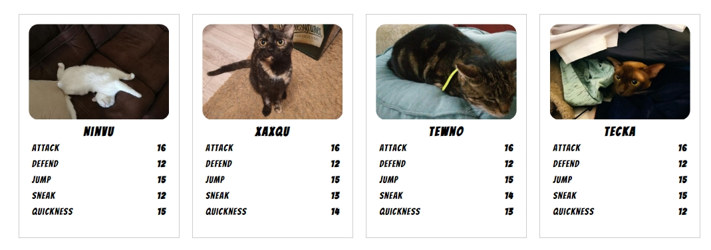

# Rundenbasierter Katzenkampf

Vorab:  
Gewürfelt wird mit einem "plusminus W6". Ein normaler sechsseitiger Würfel, bei dem gerade Zahlen zum eigenen Wert addiert werden, ungerade Zahlen werden abgezogen. Mehr Infos dazu unter "Sonderregeln".

Die Konfiguration der Katzen findest du ganz unten in dieser Anleitung.

## BEGINN
Zuerst wird gewürfelt, die Katze, die die höhere Augenzahl würfelt, fängt an.

## SNEAK
Katze A beginnt mit einem Anschleichen auf Katze B. Beide Würfeln und verändern mit der gewürfelte Augenzahl ihren Wert SNEAK und vergleichen beide Werte. Ist der Wert SNEAK von Katze A höher als Katze B, schafft es Katze A sich heran zu schleichen und kann sofort eine Attacke ausführen. Ist der Wert von Katze B höher, bemerkt sie das Anschleichen und ist mit der Attacke dran.

## ATTACK 
Angenommen Katze A attackiert Katze B. Katze A würfelt und verändert damit ihren Wert "ATTACK". Katze B hat nun zwei Optionen: DEFEND oder JUMP. Ein DEFEND ist ein parieren des Angriffs, bei einem JUMP versucht Katze B dem Schlag durch einen Sprung auszuweichen. Zwischen DEFEND oder JUMP muss sich entschieden werden, erst dann darf darauf gewürfelt werden.

## DEFEND
Hat sich Katze B für ein DEFEND entschieden, würfelt sie und verändert damit ihren Wert DEFEND. Der Wert wird mit dem ATTACK von Katze A verglichen. Ist ihr Wert höher oder gleich dem (veränderten) Wert ATTACK von Katze A, pariert sie den Schlag. Allerdings ist Katze A dann erneut mit einer Attacke dran.

## JUMP
Entscheidet sich Katze B für JUMP, würfeln Katze B und Katze A auf ihren JUMP-Wert und verändern ihn durch den Würfel. Liegt der Wert von Katze B höher als der von Katze A, kann sie sich durch einen geschickten Sprung entziehen und entgeht der Attacke. Sie ist dann dran mit attackieren. Liegt der Wert von Katze A höher als der von Katze B, springt Katze B zwar weg, aber Katze A hinterher und Katze A ist erneut mit einer Attacke dran.

## HEALTH
Jede Katze hat 3 Lebenspunkte. Misslingt ein DEFEND oder ein JUMP, wird ein Treffer erzeugt. Die Katze verliert einen Lebenspunkt. Bei 0 Lebenspunkten geht die Katze K.O. und wird (temporär) bewusstlos; das Spiel ist dann zu Ende.

## SONDERREGELN
## KRITISCHER TREFFER
Szene: ATTACK.  Würfelt man eine 6, kann man erneut würfeln. Würfelt man im Bestätigungswurf erneut eine 6, ist das ein kritischer Treffer, der von der anderen Katze nicht pariert werden kann. Der anderen Katze wird sofort ein Lebenspunkt abgezogen. 

## KRITISCHER PATZER
Szene: ATTACK.  Würfelt man eine 5, würfelt man erneut. Würfelt man im Bestätigungswurf erneut eine 5, ist das ein kritischer Patzer. Man holt mit der Tatze aus, verfehlt aber die andere Katze und verliert das Gleichgewicht auf der Mauer. Die andere Katze ist dann dran mit der Attacke.

## GLÜCKLICHE FÜGUNG
Szene: DEFEND. Würfelt man eine 6, kann man erneut würfeln. Würfelt man im Bestätigungswurf erneut eine 6, ist das eine GLÜCKLICHE FÜGUNG, man gewinnt Oberhand und pariert den Schlag der anderen Katze so gekonnt, dass man jetzt dran ist mit attackieren.

## PECHVOGEL
Szene: DEFEND. Würfelt man eine 5, würfelt man erneut. Würfelt man im Bestätigungswurf erneut eine 5, ist man so ungeschickt, dass man während der Attacke von der Mauer fällt und somit gleichzeitig 2 Lebenspunkte verliert.

**Übrigens:** Kann ein Wert nicht bestätigt werden, zählt er einfach. Also 6 & 1 = 6; 6  & 4 = 6; etc.; das Gleiche gilt für eine nicht bestätigte 5.

## FLUCHT
Angenommen: Katze A möchte fliehen, um ihre Lebenspunkte zu retten. Das geht nur, wenn sie gerade Oberhand hat, also attackieren darf. Jetzt würfeln Katze A und Katze B auf QUICKNESS. Ist der Wert von Katze A höher als der von Katze B, entwischt Katze A und ist sicher. Ist der Wert von Katze B höher, holt Katze B die Katze A ein und Katze B hat Oberhand, kann also mit einer Attacke beginnen. Auch hier wieder: Sollte Katze A eine 6 würfeln und im zweiten Wurf bestätigen, entwischt sie sofort. Würfelt Katze B zweimal hintereinander die 6, wird Katze A sofort eingeholt. Würfelt Katze A zweimal hintereinander eine 5, stolpert sie, verliert einen Lebenspunkt und Katze B holt sie sofort ein. Würfelt Katze B zweimal hintereinander eine 5, verletzt sie sich bei der Jagd nach Katze A und verliert einen Lebenspunkt.

## REGENERATION
Spielt man mit mehreren Katzen, kann sich eine FLUCHT durchaus lohnen. Die Katze, die erfolgreich geflohen ist, wird zur Seite gelegt. Pro 5 Minuten erholt sich 1 Lebenspunkt.

## ANDERE REGELN
Möchtest du die Regeln abändern oder ergänzen? Mach es einfach, wie es dir gefällt ^.^ Hauptsache, ihr habt Spaß beim Spiel und es bleibt Fair.

## BEISPIELKATZE
Achte darauf, dass bei der Verteilung der Werte die Gesamtsumme 70 ergibt.

"Tecka"  
Attack: 16  
Defend: 12  
Jump: 15  
Sneak: 15  
Quickness: 12  

